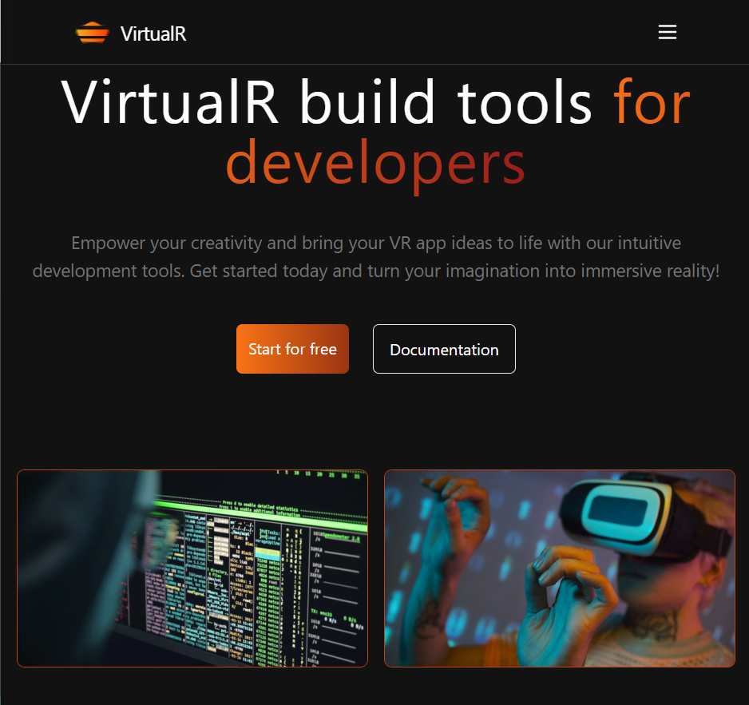

# 🌐 VirtualR

**VirtualR** is a modern React-based web project designed to offer a sleek, responsive interface for showcasing development services. It features animated text, gradient UI elements, and a mobile-friendly layout.

## 🚀 Features

- 🖥️ Built with **React** and **Vite**
- 🎨 Styled using **Tailwind CSS**
- 📱 Fully **responsive design**
- ✨ Custom animated headings and smooth gradients
- 📂 Clean folder structure for easy scalability

## 🛠️ Tech Stack

- React
- Vite
- Tailwind CSS
- JSX
- Git & GitHub

## 📸 Screenshots



## 🧪 Setup & Installation

```bash
# Clone the repo
git clone https://github.com/Shaurya-Sehdev/VirtualR.git

# Navigate to project folder
cd VirtualR

# Install dependencies
npm install

# Start the development server
npm run dev
```

Project Structure:-

VirtualR/
├── public/
├── src/
│ ├── assets/
│ ├── components/
│ ├── constants/
│ ├── App.jsx
│ └── main.jsx
├── tailwind.config.js
├── index.html
└── package.json
